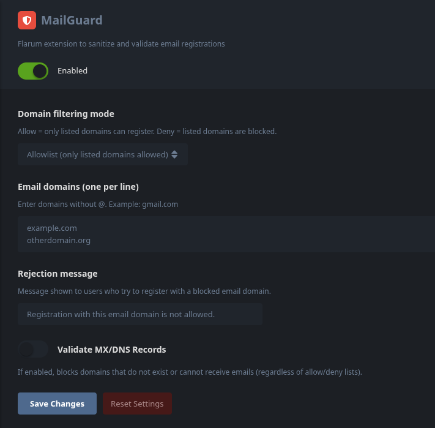
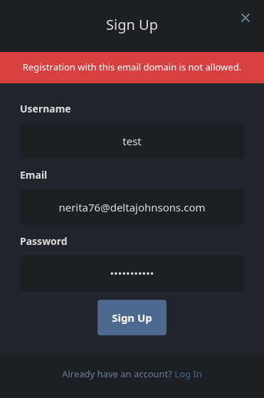

# Flarum MailGuard
 [](https://opensource.org/licenses/MIT)
[](https://packagist.org/packages/anto0102/mailguard)
[](https://packagist.org/packages/anto0102/mailguard)
[](https://packagist.org/packages/anto0102/mailguard)

MailGuard is a lightweight, ultra-optimized Flarum 2.0 extension to securely guard and validate email domains during user registration. Built entirely without external GUI frameworks to guarantee **zero impact on server memory** and provide instant, real-time blocking of unwanted users.

**Weight on GitHub:** < 10KB
**Speed:** < 1ms

---

## 📸 Screenshots

### Admin Settings Panel
<div align="center">
  
</div>

### Registration Blocked Example
<div align="center">
  
</div>

---

## ✨ Features
* **Allowlist / Denylist Settings**: Block specific disposable email domains or restrict your forum strictly to internal company emails.
* **Alias Anti-Fraud & Sanitization**: Protect your forum against "infinite registration" tricks using `+` or `.` aliases (like Gmail). Block them strictly or sanitize them silently to keep your database clean.
* **DNS/MX Live Validation**: Even if an email looks valid, MailGuard does a live server intercept to verify if the MX records exist. Fake domains are instantly blocked.
* **Database Exporter**: Instantly retrieve and export the email domains of all users currently on your forum.
* **CLI Auditing**: Run terminal commands to discover or permanently remove users belonging to bad email domains.

---

## 🚀 Installation

Install the extension via Composer:
```sh
composer require anto0102/mailguard
```

*(Ensure you rebuild your Flarum extension cache after installation)*
```sh
php flarum cache:clear
```

---

## 🛠️ CLI Commands & Audit System

MailGuard comes with powerful CLI tools to inspect your current database and handle non-compliant existing users. Check command outputs in your standard terminal console.

### Exporting Domains
To extract domains from your current userbase and save them securely (available in `csv` or `json` formats):
```sh
php flarum emailguard:export
php flarum emailguard:export --format=json
```
*(The file is automatically saved within your Flarum `storage/tmp` directory, ensuring no impact on the forum. The terminal response will show the exact absolute path where it was saved).*

### Auditing Existing Users
To check if any of your existing users match the domains currently denied in your MailGuard settings. This will print a clear table directly in your terminal showing the non-compliant users:
```sh
php flarum emailguard:audit
```

### Deleting Non-Compliant Users
To completely and **permanently delete** users that match blocked domains from the database. (Note: Administrators are always skipped and protected to prevent accidental lockouts).
```sh
php flarum emailguard:audit --delete
```

---

## 📄 License
This project is licensed under the **MIT License**.

## 🤝 Support & Issues
If you experience any bugs, have questions, or want to suggest new features:
* Please [**Open an Issue**](https://github.com/anto0102/MailGuard/issues) directly on this GitHub repository.
* Or contact me on GitHub. 

Any feedback is welcome!
